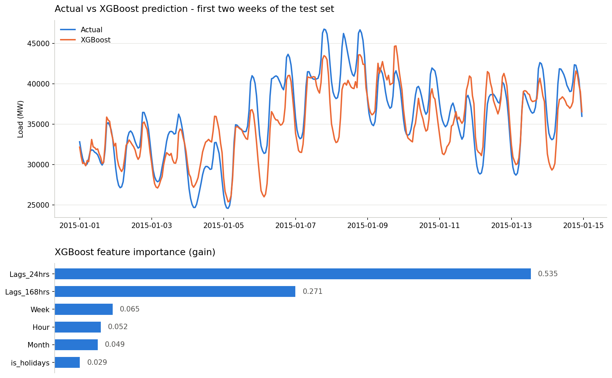

# PJME Hourly Load Forecasting

Forecasting hourly electricity load for the PJM East (PJME) zone from calendar
features and lagged load. A linear baseline and a gradient-boosted tree model are
trained on identical features and an identical chronological split, so the gap
between them is attributable to the model rather than to the data preparation.

## Results

Test set: 31,440 hourly observations, 2015-01-01 onward.

| Model | RMSE (MW) | MAPE (%) |
|---|---|---|
| LinearRegression | 2624.68 | 6.25 |
| XGBoost | **2445.27** | **5.64** |

XGBoost wins on both metrics, but by a modest margin — roughly 180 MW of RMSE and
0.6 percentage points of MAPE. With two lag features carrying most of the signal,
there is not much left for the model class to add. Getting materially below this
requires new information, not a better regressor.



## Data

[PJM Hourly Energy Consumption](https://www.kaggle.com/datasets/robikscube/hourly-energy-consumption)
(Kaggle) — `PJME_hourly.csv`, hourly load in MW for the PJM East zone,
2002-12 to 2018-08, 145,366 observations.

The raw file is **not** in chronological order. Sorting the index is the first step
of the pipeline: `shift()` builds lag features from adjacent rows, so on an unsorted
frame the lags are drawn from the wrong timestamps and the model is silently invalid.

## Features

| Feature | Description | Gain |
|---|---|---|
| `Lags_24hrs` | Load at the same hour on the previous day | 0.535 |
| `Lags_168hrs` | Load at the same hour one week earlier | 0.271 |
| `Week` | Day of week | 0.065 |
| `Hour` | Hour of day | 0.052 |
| `Month` | Month | 0.049 |
| `is_holidays` | US federal holiday flag (`holidays` library) | 0.029 |

Target: `PJME_MW`. The two lags account for 80.6% of total gain.

## Method

- **Split:** chronological, not random. Train `< 2015-01-01` (113,758 rows), test
  `>= 2015-01-01` (31,440 rows). A random split would leak future information into
  training through the lag features.
- **Baseline:** `LinearRegression`, default parameters.
- **Model:** `XGBRegressor` — `n_estimators=1000`, `learning_rate=0.05`,
  `max_depth=6`, `subsample=0.8`, `colsample_bytree=0.8`, `random_state=42`.
- **Metrics:** RMSE in MW (absolute, comparable to load magnitude) and MAPE in
  percent (scale-free, the metric the industry quotes; good day-ahead load forecasts
  run in the 3-5% range).

## Where the error lives

Rather than stopping at a single aggregate number, the notebook breaks the residuals
down by load level, by hour, and by holiday status.

**The model compresses the range.** Split by decile of actual load, the bias runs
close to monotone from over- to under-prediction:

| Load level | Mean actual (MW) | Mean bias (MW) |
|---|---|---|
| Lowest decile | 22,040 | +825 (over-predicts) |
| Middle | 30,966 | +691 |
| Highest decile | 44,605 | −1,745 (under-predicts) |

This is regression toward the mean, and it follows directly from the feature set:
a prediction anchored to load 24 and 168 hours ago cannot commit to a value far
from recent history. Peaks are under-predicted by 3.9% on average — the expensive
direction of error, since peak load is what generation capacity has to cover.

**The bias is a daytime effect.** Mean residual over the whole test set is +225 MW.
By hour it is small overnight (54-111 MW between 00:00 and 06:00) and largest in the
early afternoon (375 MW at 14:00). The model runs systematically high during working
hours.

**Holidays remain weak.** MAPE is 6.34% on federal holidays against 5.62% on normal
days — 13% relatively worse. A binary flag tells the model *that* a day is a holiday
but not that the holiday load *curve has a different shape*, which is why it carries
the least gain of any feature.

## Repository

```
PJME_load_forecasting.ipynb   full pipeline, executed with outputs
results.png                   predicted vs actual, and feature importance
```

## Running it

```bash
pip install pandas numpy scikit-learn xgboost holidays matplotlib
```

Place `PJME_hourly.csv` next to the notebook (or point the `PJME_CSV` environment
variable at it) and run all cells. The run regenerates the figure as
`figures/results.png` and also writes `results.json` (metrics and residual
diagnostics) and `plot_data.csv` (the plotted two-week window).

## Roadmap

Ordered by expected impact:

- **Weather features** — temperature, plus heating- and cooling-degree days. The
  largest missing driver, and the direct fix for the compressed range: extreme load
  is a temperature response the current feature set cannot see at all.
- **Holiday load shape** instead of a holiday flag — an hour-of-day profile that
  differs on holidays rather than one binary column.
- **Peak-weighted evaluation** — the aggregate MAPE hides a 3.9% shortfall at the
  peaks. Reporting error on the top decile separately makes the failure that matters
  operationally visible.
- **Probabilistic forecasting** — quantile regression for prediction intervals rather
  than a single point forecast, which is closer to how forecasts are actually consumed.
- **Engineering comparison** — training time, memory, hyperparameter sensitivity, and
  whether the two models agree on feature importance. More informative than chasing
  another fraction of a percent of RMSE.
